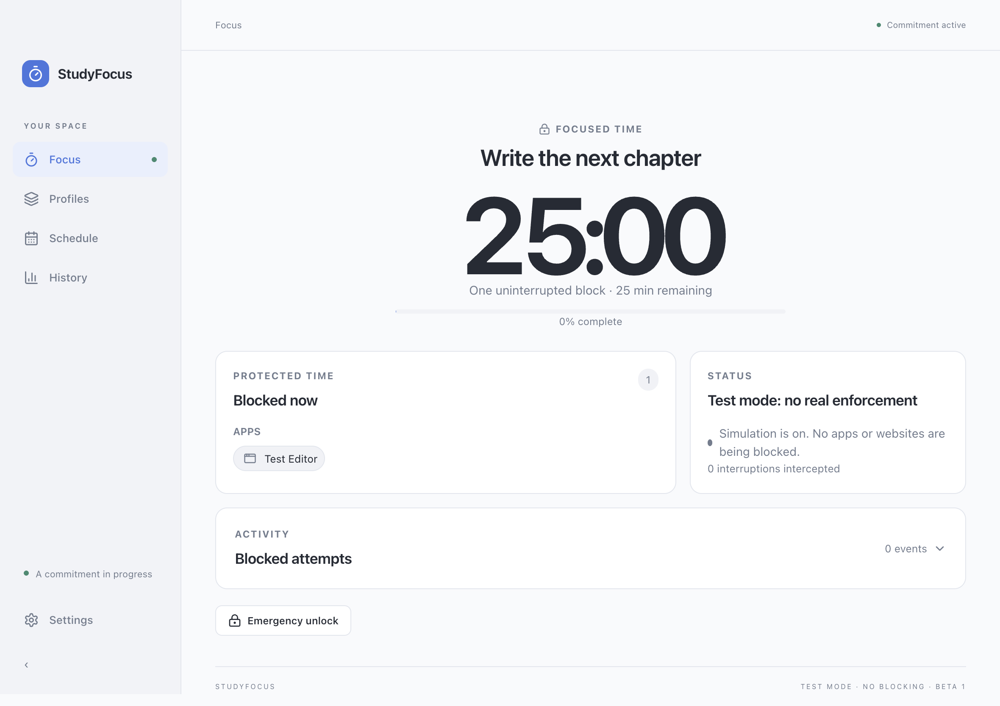

# StudyFocus

StudyFocus is a local macOS focus app. You make a time commitment, choose apps and
websites, and the local engine enforces that commitment until it completes or you
explicitly use Emergency unlock.

The app is currently in `1.0.0-beta.1`. I am currently waiting on approval from the 
Chrome Web System for the extension counterpart.

## Features

- Focus blocks and Pomodoro sessions with a menu-bar timer.
- Mac application blocking and a Chrome website-blocking companion.
- Strict commitments, explicit emergency unlock, and offline recovery.
- Named profiles and recurring weekly schedules with overlap checks.
- Local history, JSON export, legacy migration, and light/dark appearance.



*The preview uses isolated test mode; real app and Chrome blocking were verified separately.*

## Install the beta

Use an Apple Silicon DMG for M-series Macs or an Intel DMG for Intel Macs.
The app requires macOS 13 or later. This repository contains the source; see the
release notes for the build's distribution and validation status.

To build your own package, install Node.js 24 and Apple's Xcode Command Line Tools
(which provide Swift and the macOS SDK), then run from the repository folder:

```bash
npm ci
npm run dist
```

Open the generated DMG and drag StudyFocus to the Applications folder. Launch
StudyFocus from Applications. The DMG is configured with the same drag-to-Applications
layout users will see in a packaged release.

Because this beta is unsigned, macOS may ask for its normal security approval when
you open it. The release path is to sign and notarize the application; users should
not be asked to weaken macOS security controls.

For a step-by-step walkthrough, see [docs/USER_GUIDE.md](docs/USER_GUIDE.md).

## First commitment

From Focus, add applications with the app picker and add websites as domains. Choose
Focus for one uninterrupted block or Pomodoro for work rounds separated by breaks.
Confirm the commitment to start enforcement. The engine persists the session locally,
so closing the window does not end it.

Website blocking has two local paths:

- The Chrome connector applies browser rules through a local native-messaging host.
- Optional System website blocking applies exact domains through the macOS system
  hosts helper. It asks for administrator approval when a session starts and is
  useful for coverage across browsers. Chrome supplies full subdomain coverage.

The Chrome extension store listing is not published in this beta. In Settings, use
Install Chrome connector, then Open extension. Open `chrome://extensions`, enable
Developer mode, choose Load unpacked, and select the bundled `chrome` directory.
Enable the extension for Incognito if Incognito coverage is needed. This is a local
development path; public installation requires a signed/notarized app and a published
Chrome Web Store extension.

## Profiles and schedules

Profiles save a named Focus or Pomodoro setup, including its duration, applications,
and websites. Schedules select an existing profile and a weekday/time. Enabled
schedules are checked by the engine and reject overlaps with other enabled schedules
or with a session that would already be active.

If the Mac or StudyFocus is unavailable at a scheduled start, the start is recorded
as missed and is not replayed later. A start that cannot run because another
commitment is active, the profile is missing, or setup fails is recorded as failed
with its reason.

## Emergency cleanup

There is no ordinary early-exit action. Emergency unlock is an explicit confirmation
from the app or menu bar. It records an `emergency` history entry, releases app
enforcement, asks the Chrome connector to reconcile, and clears the optional system
website helper state. If website rules remain pending, Settings provides Repair.

History shows committed/focused time separately from verified enforcement time.
Verified enforcement indicates that the local blockers were active; it does not
measure attention.

## Local storage and privacy

The packaged app stores StudyFocus data under:

```text
~/Library/Application Support/StudyFocus/
```

The engine uses a local Unix socket and a per-install token. Profiles, schedules,
history, settings, and active-session state remain on the Mac unless the user chooses
Export data. Settings can open the data folder directly.

The migration action looks for the legacy files under `~/.studyfocus/`. It validates
the old history, backs up the legacy files into a `legacy-backup` directory beside the
new local data, imports history as `legacy`, and can import the old setup as a profile.
Unavailable or protected apps are reported and omitted from an imported profile.

## Background recovery

The packaged app can register a per-user background service. It first uses
`SMAppService` on macOS 13 and later. In the unsigned beta, it falls back to a user
LaunchAgent when the modern registration path is unavailable. The service keeps the
engine available for login recovery and schedules; uninstall is rejected while a
session, pending website cleanup, or enabled schedule still needs it.

## Developer workflow

The project is an Electron app with a React/Vite renderer, a local engine, a bundled
Swift helper, and a Manifest V3 Chrome extension.

```bash
npm start            # Build the renderer and native helper, then launch Electron
npm run dev          # Vite + Electron development flow
npm run build        # Production renderer build
npm run native       # Build the universal native helper
npm test             # Node test runner
npm run typecheck    # TypeScript contract check
npm run test:desktop # Playwright/Electron desktop flow
npm run pack         # Unpacked macOS package
npm run dist         # DMG and ZIP packages
```

`npm run native` builds arm64 and x86_64 helpers and combines them into the universal
`native/build/StudyFocusNative`. Set `TARGET_ARCH=arm64` or `TARGET_ARCH=x64` when a
single architecture is needed. The current test coverage is Apple Silicon only;
universal compilation does not mean both architectures have been exercised on
hardware.

The desktop process in `desktop/main.cjs` owns the trusted IPC bridge and starts the
engine service. `engine/core.mjs` owns sessions, schedules, history, Chrome policy,
and settings. `desktop/registration.cjs` owns service registration. The extension in
`chrome/` connects through the native host written by the Swift helper. Keep renderer
code on the commands exposed by `src/api.js`; the engine remains authoritative.

See [docs/RELEASE_NOTES.md](docs/RELEASE_NOTES.md) for completed checks and remaining release validation. This README does not claim
tests or hardware checks that have not been observed in the release workflow.

## Project layout

| Directory | Purpose |
| --- | --- |
| `src/` | React desktop interface |
| `desktop/` | Electron window, menu bar, IPC, and service registration |
| `engine/` | Sessions, schedules, persistence, and enforcement |
| `native/` | Swift app discovery, native messaging, and optional hosts helper |
| `chrome/` | Manifest V3 browser companion |
| `shared/` | Domain validation and interface contracts |
| `tests/` | Core, Chrome-rule, and native-protocol regression checks |
| `scripts/` | Development, packaging, and isolated integration checks |

## Documentation

- [User guide](docs/USER_GUIDE.md)
- [Release notes and known limitations](docs/RELEASE_NOTES.md)
- [Contributing and development](CONTRIBUTING.md)
- [Architecture contract](docs/IMPLEMENTATION.md)

No open-source license has been selected for this project yet.
